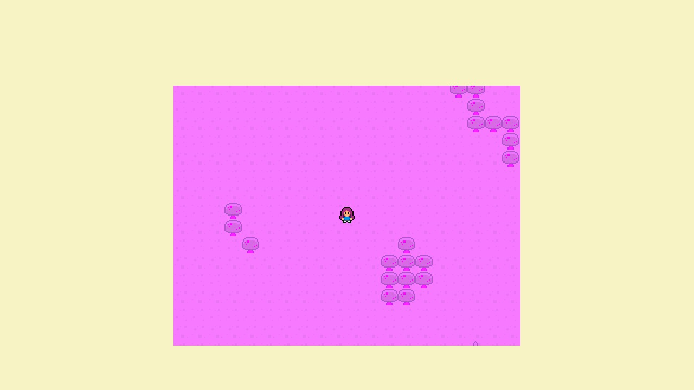
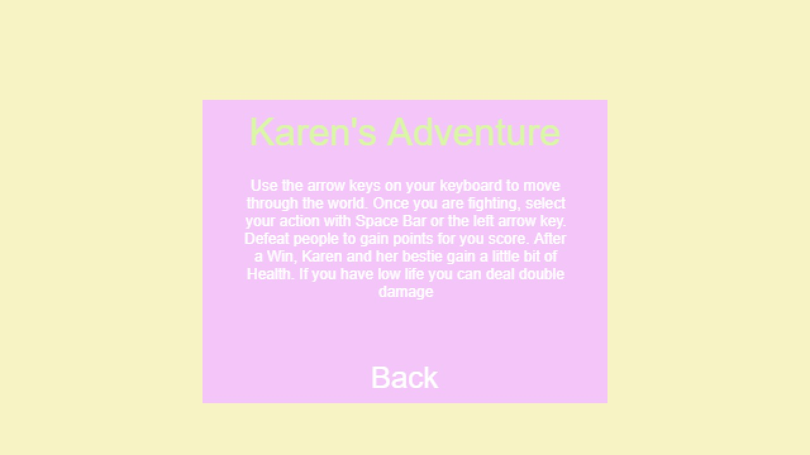
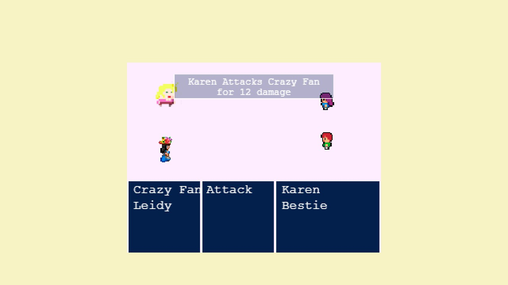

# Karen's Adventure - Phaser RPG

Karen is a big fan of the Jonas Brothers, and now they will be in town. Help Karen to get to the concert, fight all the opposition as her mother, a ticket reseller, crazy fans, and many more to attend the supreme event.

This game was created using the framework Phaser 3 and JavaScript, I add test units with Jest and the functions are modules, best practices incorporated(ES6).

This game is optimized for desktops and tablets, mobile isn't a good experience.



# Intructions





## Live demo

[You can play the game HERE!](https://nervous-hypatia-7cd6e3.netlify.app/)

## Game Functionality

# Objective
- Defeat all the people to get Karen to the concert
# Controls
- Press ⬆️ to move up
- Press ⬇️ to move down
- Press ➡️ to go right
- Press ⬅️ to go left
# Controls in Battle
- Press ⬆️ or ⬇️ to select who you are going to attack
- Press Space to attack
## Built With

- JavaScript
- HTML
- CSS
- Webpack
- Phaser 3
- Jest

## How to start the project from your Local environment

- Open your terminal and cd where you want to store the project
- To clone the repository run the following command:
```bash
git clone https://github.com/mricanho/RPG-phaser.git
```
- Now run:
```bash
npm install
```
- Finally run:
```bash
yarn start
```
- Go to the dist folder and select index.html, now Open the live server on your VScode `Alt + L` then `Alt + o`

## How to run the Tests

It's super easy to run the tests using Jest, in the root directory, go to your terminal and run:
```bash
yarn test
```
## Author

👤 **Miguel Ricaño**

- Github: [@mricanho](https://github.com/mricanho)
- Linkedin: [Miguel Ricaño](https://www.linkedin.com/in/mricanho/)

## 🤝 Contributing

Contributions, issues, and feature requests are welcome!

## Show your support

Give a star if you :star: like this project!

## Acknowledgments

- Microverse
- GitHub
- TheOdinProject
- JavaScript

This project is [MIT](LICENSE) licensed.