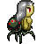

# Karen's Adventure - Phaser RPG

Karen is a big fan of the Jonas Brothers, and now they will be in town. Help Karen to get to the concert, fight all the opposition as her mother, a ticket reseller, crazy fans, and many more to attend the supreme event.

This game was created using the framework Phaser 3 and JavaScript, I add test units with Jest and the functions are modules, best practices incorporated(ES6).

My initial objectives with this game were three:

- Make the game functional
- Make the game fun
- Make the game pretty

I succeed in two of them, make the game functional and pretty, but I need more time to make the game fun to play, this could be achieved with more scenes that explain the story, and/or dialogues between the characters, also it could be nice to have more maps, attacks, and items.

This game is optimized for desktops and tablets, mobile isn't a good experience.


### Instructions


## Live demo

[You can play the game HERE!](https://nervous-hypatia-7cd6e3.netlify.app/)

# Game Design

### Introduction

I need to create an RPG game, that has at least when the battle scene and different kinds of enemies and allies.

### Story and Gameplay
Karen is a super big fan of the Jonas Brothers, and now they will be in town. But of course, life is not easy, and to finally achieve going to the incredible concert she needs to surpass any obstacle, from her mother not giving her permission to go to the concert, a crazy fan that wants to steal her ticket for the show, a ticket reseller with ridiculous prices and her friend who thinks that the Jonas Brothers are garbage. Help Karen to get to the concert, fight all the opposition. 

You can move through the map to find the concert spot, if you encounter an enemy, fight them and continue your journey, if they defeat you lost the opportunity to go to the concert and the game is over.
### Objective
- Defeat all the people to get Karen to the concert.

### Assets
I tried to find good matches for this game, the audios are from an 8-bit version of some Jonas Brothers songs, I create the background and try to match everything to pink which is the predominant color. The images come from Opengameart, and I did some modifications to them.

#### Heroes
| Asset  | Heroe_ |
| ------------- | ------------- |
|   | Karen |
|    | Karen's bestie(A.K.A. Her BF)  |
#### Enemies
| Asset  | Enemy |
| ------------- | ------------- |
|   | Karen's mother Leidy |
|    | Ticket Reseller  |
|    | Karen's friend Ximena |
|    | Crazy Fan  |

### Controls
- Press ⬆️ to move up
- Press ⬇️ to move down
- Press ➡️ to go right
- Press ⬅️ to go left
### Controls in Battle
- Press ⬆️ or ⬇️ to select who you are going to attack
- Press Space to attack
## Built With

- JavaScript
- HTML
- CSS
- Webpack
- Phaser 3
- Jest

## How to start the project from your Local environment

- Open your terminal and cd where you want to store the project
- To clone the repository run the following command:
```bash
git clone https://github.com/mricanho/RPG-phaser.git
```
- Now run:
```bash
npm install
```
- Finally run:
```bash
yarn start
```
- Go to the dist folder and select index.html, now Open the live server on your VScode `Alt + L` then `Alt + O`

## How to run the Tests

It's super easy to run the tests using Jest, in the root directory, go to your terminal and run:
```bash
yarn test
```
## Author

👤 **Miguel Ricaño**

- Github: [@mricanho](https://github.com/mricanho)
- Linkedin: [Miguel Ricaño](https://www.linkedin.com/in/mricanho/)

## 🤝 Contributing

Contributions, issues, and feature requests are welcome!

## Show your support

Give a star if you :star: like this project!

## Acknowledgments

- Microverse
- GitHub
- [Opengameart](https://opengameart.org/) for the images
- Phaser for the documentation
- JavaScript

This project is [MIT](LICENSE) licensed.
